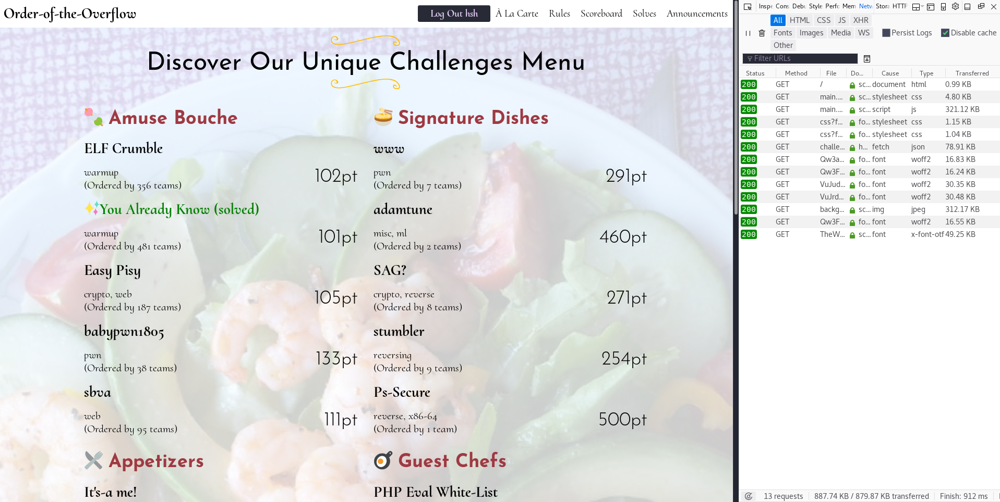
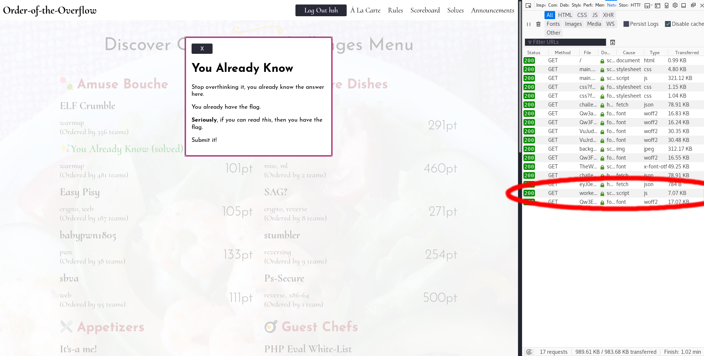
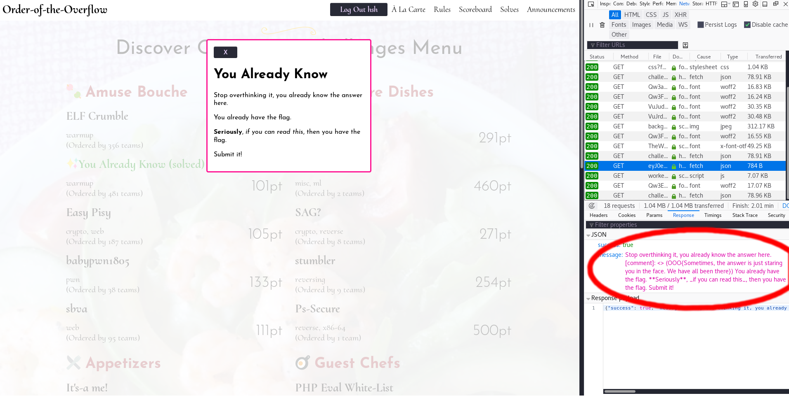

# You Already Know
Category: Warmup (Web)

After looking the in the html, css, and json files, I noticed that "if you can read this" was emphasized.

During the iFixit Triatholon (an event White Hat and iFixit put on every year), [@attila](https://github.com/atti1a) wrote a few web challenges in which flags were hidden in the headers and such.

I opened the developers tools to get a look at what was happening on the webpage, and I saw several requests that looked normal. 

Then, I click on the challenge, and I noticed that three requests were sent out when the challenge was clicked: a fetch, script, and a font request.

Then, I determined that the fetch was probably of interest. On inspection of the response message, I noticed that there was a comment inside of the message:

The comment contained the flag: OOO{Sometimes, the answer is just staring you in the face. We have all been there}
