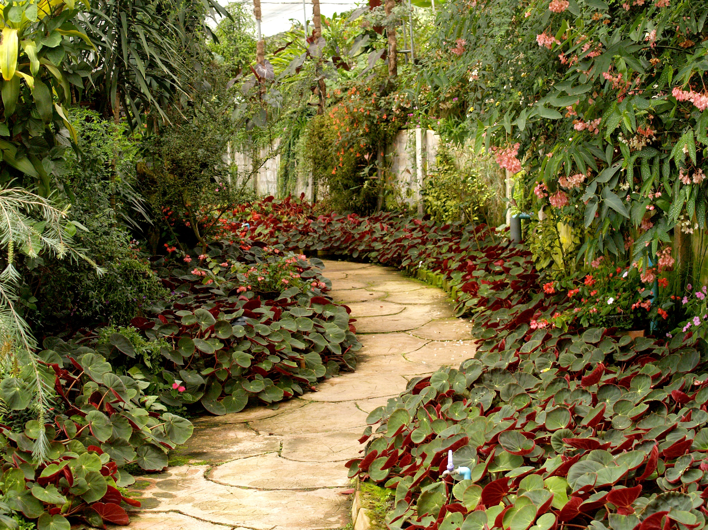

# PicoCTF 2019 - Glory of the Garden
Author: PinkNoize

Glory of the Garden - 50

> This garden contains more than it seems. You can also find the file in /problems/glory-of-the-garden_3_346e50df4a37bcc4aa5f6e5831604e2a on the shell server.

# Writeup

Upon going to the specified directory we see a jpg file.



There is nothing interesting in the image. If we run `strings garden.jpg`, which lists any strings in the file, we get the the flag.

```bash
user@pico-2019-shell1:/problems/glory-of-the-garden_3_346e50df4a37bcc4aa5f6e5831604e2a$ strings garden.jpg 
...
jc#k
=7g&
mjx/
s\]|."Ue
\qZf
Here is a flag "picoCTF{more_than_m33ts_the_3y35a97d3bB}"
```

The flag is `picoCTF{more_than_m33ts_the_3y35a97d3bB}`.