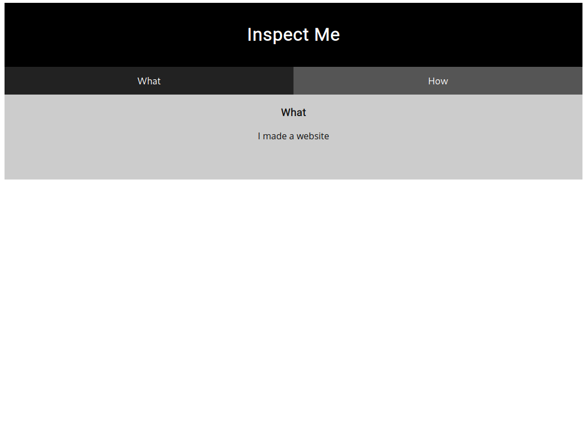

# PicoCTF 2019 - Insp3ct0r
Author: PinkNoize

Web Exploitation - 50

> Kishor Balan tipped us off that the following code may need inspection: https://2019shell1.picoctf.com/problem/11196/ (link) or http://2019shell1.picoctf.com:11196

## TL;DR

This challenge consists of a website with the flag spread across multiple files of the website. View the source for the flag.

# Writeup

This challenge description directs us to a link saying the the code needs inspection.



As the page itself doesn't have anything interesting we can view the source of the page.

```html
<!doctype html>
<html>
  <head>
    <title>My First Website :)</title>
    <link href="https://fonts.googleapis.com/css?family=Open+Sans|Roboto" rel="stylesheet">
    <link rel="stylesheet" type="text/css" href="mycss.css">
    <script type="application/javascript" src="myjs.js"></script>
  </head>

  <body>
    <div class="container">
      <header>
	<h1>Inspect Me</h1>
      </header>

      <button class="tablink" onclick="openTab('tabintro', this, '#222')" id="defaultOpen">What</button>
      <button class="tablink" onclick="openTab('tababout', this, '#222')">How</button>
      
      <div id="tabintro" class="tabcontent">
	<h3>What</h3>
	<p>I made a website</p>
      </div>

      <div id="tababout" class="tabcontent">
	<h3>How</h3>
	<p>I used these to make this site: <br/>
	  HTML <br/>
	  CSS <br/>
	  JS (JavaScript)
	</p>
	<!-- Html is neat. Anyways have 1/3 of the flag: picoCTF{tru3_d3 -->
      </div>
      
    </div>
    
  </body>
</html>
```

As we can see in the comment, we have 1/3 of the flag, `picoCTF{tru3_d3`.

In the html we can see two more files, `mycss.css` and `myjs.js`.

When we view these files, we find two comments

```css
/* You need CSS to make pretty pages. Here's part 2/3 of the flag: t3ct1ve_0r_ju5t */
```

```js
/* Javascript sure is neat. Anyways part 3/3 of the flag: _lucky?9df7e69a} */
```

Using these 3 parts we can make the flag, `picoCTF{tru3_d3t3ct1ve_0r_ju5t_lucky?9df7e69a}`.