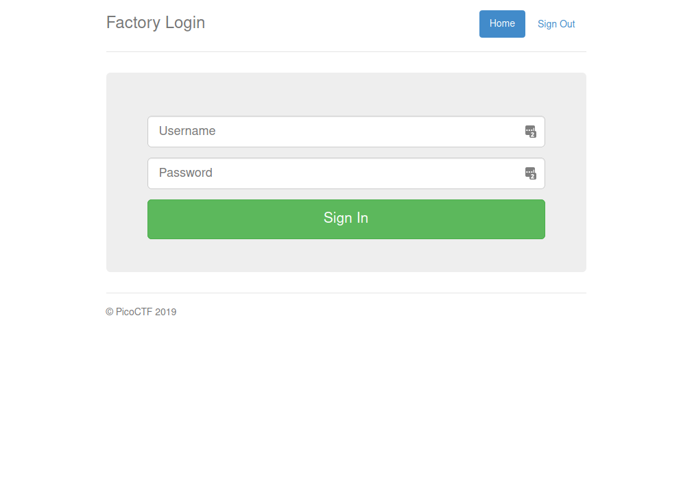
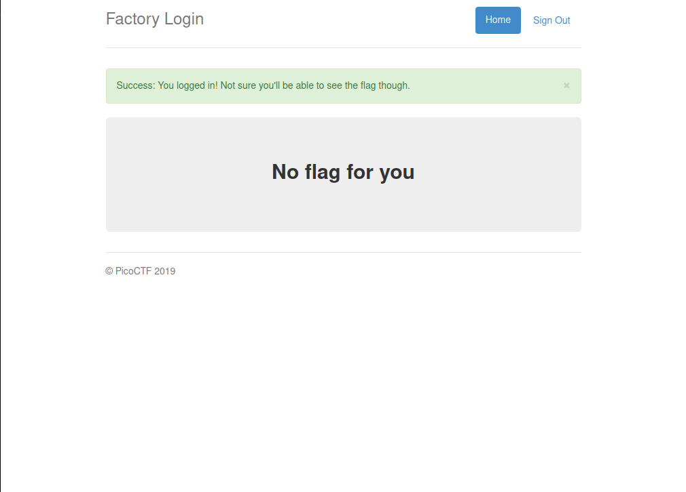
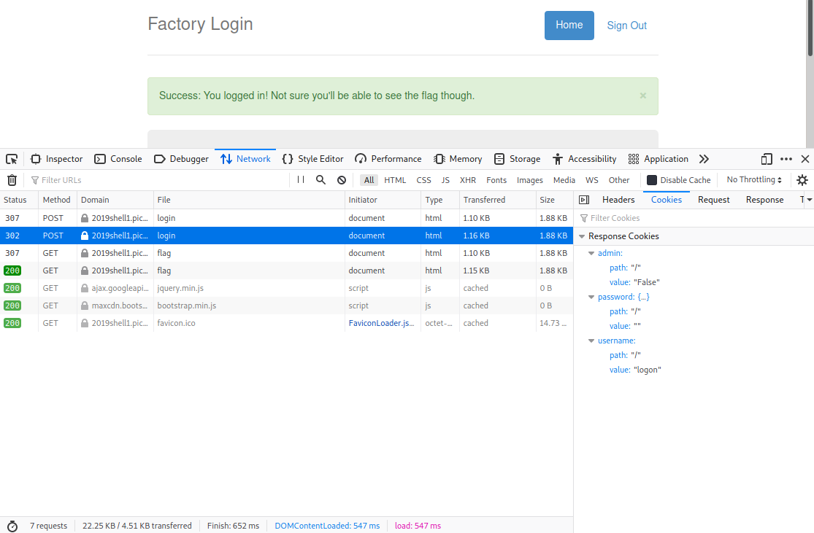
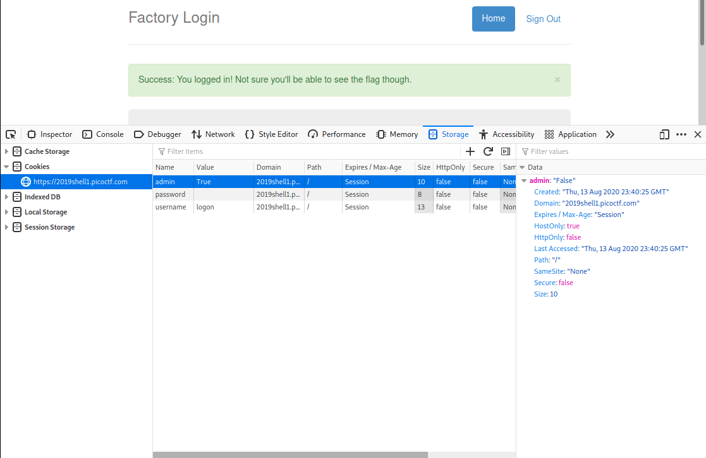
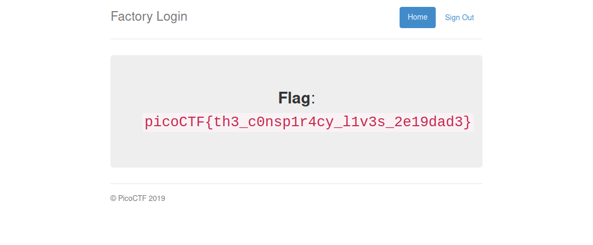

# PicoCTF 2019 - logon
Author: PinkNoize

Web Exploitation - 100

> The factory is hiding things from all of its users. Can you login as logon and find what they've been looking at? https://2019shell1.picoctf.com/problem/37907/ (link) or http://2019shell1.picoctf.com:37907

## TL;DR

The challenge presents us with a login webpage. The flag is protected behind a boolean cookie. Change the value to true to get the flag.

# Writeup

The webpage presented to us contains a login page.

The description asks us to login as "logon" so we try to login with no password.

We were able to login, so the password might not matter. Let's view the requests to login using the network tab (Ctrl+Shift+E in Firefox).

In the second post request we see that we have cookies containing an admin attribute, a username attribute and a password attribute. Perhaps setting the admin attribute to `True` will allow us to get the flag.

We can set the cookie in Firefox by going to the storage tab (Shift+F9) and double clicking on the 'Value' part of the admin cookie.

We can then refresh the page so that the browser can get the response using the new cookie. We are then presented with the flag.

