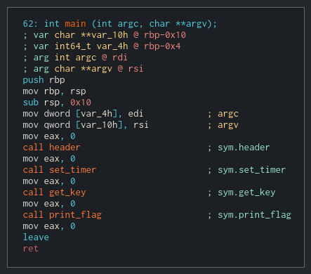
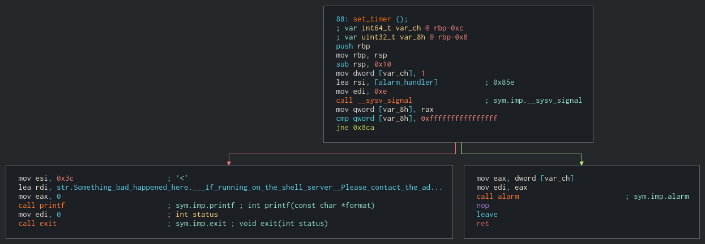
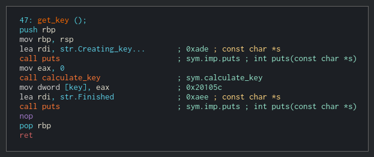
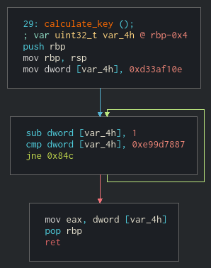
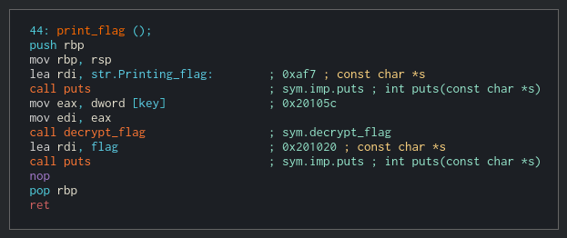
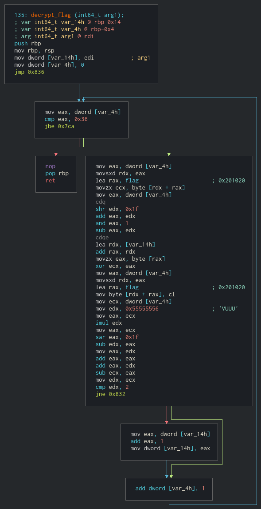
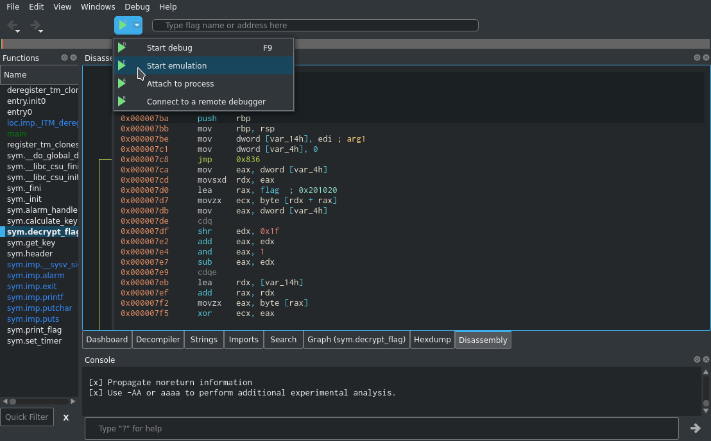
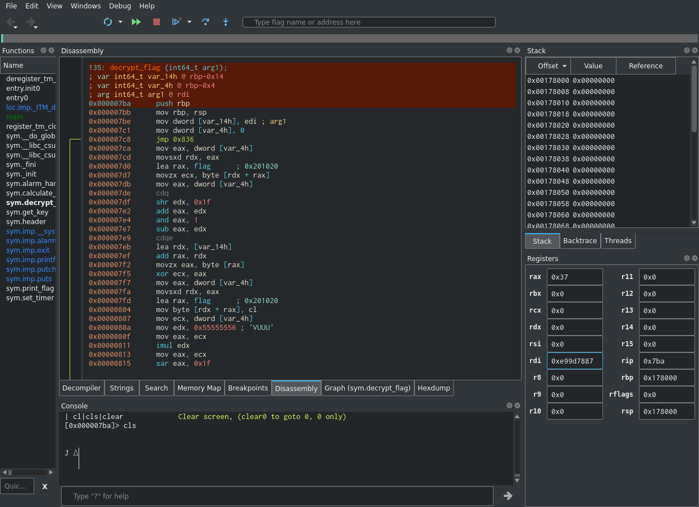
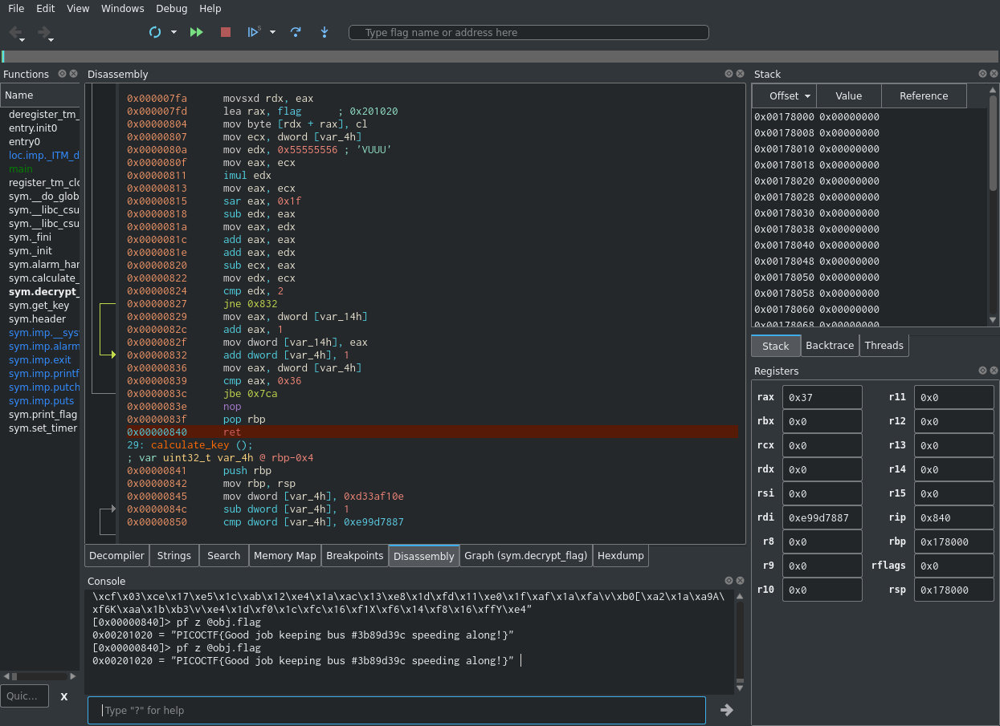

# PicoCTF 2019 - Need For Speed
Author: PinkNoize

Reverse Engineering - 400

> The name of the game is speed. Are you quick enough to solve this problem and keep it above 50 mph? need-for-speed.

## TL;DR

This challenge provides a program that sets up a short timer to kill the program. The program then calculates a key and uses the key to decrypt the flag and print it. Calculate the key manually and emulate to get the flag.

# Writeup

This challenge provides a 64-bit ELF.

```bash
$ file need-for-speed 
need-for-speed: ELF 64-bit LSB shared object, x86-64, version 1 (SYSV), dynamically linked, interpreter /lib64/ld-linux-x86-64.so.2, for GNU/Linux 3.2.0, BuildID[sha1]=4c324a73846c4d207a3be5206e16fe60d57026ba, not stripped
```

I will be using Cutter to solve this challenge. We will first start by understanding `main`.



The `main` function starts by calling `header`, `set_timer`, `get_key` and finally, `print_flag`. The `header` function appears to do nothing but print text so we will next analyze `set_timer`.



This function sets up a signal handler, then sets an alarm for 1 second. The signal handler, `alarm_handler`, exits the program when the signal arrives. This function is what makes the binary exit before `main` finishes.



`get_key` prints some strings, but most importantly calls `calculate_key` and sets a global variable, `key`, to the result of that call.



`calculate_key` is a simple function with one local variable and *no arguments*. Having no arguments means that this function always returns the same value. This function sets a variable to 0xd33af10e and subtracts 1 until it equals 0xe99d7887. It then returns that variable. This means it will always return `0xe99d7887`, which is the key.

To summarize the function `get_key`, it sets the global variable, `flag`, to `0xe99d7887`, but takes a long time doing it.



`print_flag` first prints a string then calls `decrypt_flag(flag)`, where `flag` is the global variable. It ends by printing the flag.



`decrypt_flag` is a meaty function that decrypts the flag using the calculated key. We could convert the instructions to python to decrypt the flag like we did in the previous challenge, although this would would be rather tedious. There are 3 "easy" solutions that come to mind with this challenge,

1. Patch the binary to convert the alarm call to a NOP and run the binary. We would still have to wait a bit for `calculate_flag` to finish.
2. Patch the binary to change `calculate_key` into a function that quickly returns 0xe99d7887 and run it.
3. Emulate decrypt_flag(0xe99d7887) and print the flag.

I went with the 3rd option as I wanted to learn more about emulation in Cutter and wanted to avoid running the binary (until you reverse engineer the entire binary, you never know what kind of hidden features there are).

To emulate decrypt flag, first click on `sym.decrypt_flag` in the functions window. Then click on the dropdown next to the play button as shown in the screenshot below. Then click start emulation.



To set the argument to `0xe99d7887` we need to set rdi to `0xe99d7887` as the first argument is passed in rdi. You can do this by editing the value in the registers window as shown below.



We can then continue to the end of the function by right clicking the `ret` at the end of the function and selecting `Debug` then `Continue till line`. At this point the flag should have already been decrypted. You can view the flag by navigating to `obj.flag` in the hexdump tab or by typing `pf z @obj.flag` in the console window. `pf z @obj.flag` means to print formatted data as a null terminated string(`z`) at the object `obj.flag`.



We now have the flag, `PICOCTF{Good job keeping bus #3b89d39c speeding along!}`.