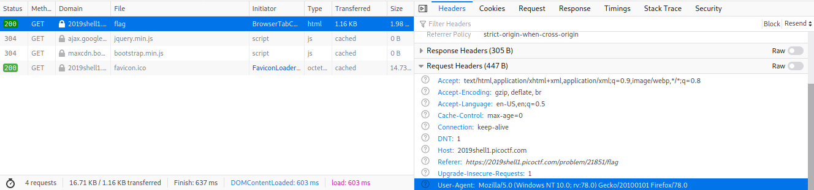

# picoCTF 2019 - picobrowser
Author: PinkNoize

Web Exploitation - 200

> This website can be rendered only by picobrowser, go and catch the flag! https://2019shell1.picoctf.com/problem/21851/ (link) or http://2019shell1.picoctf.com:21851

## TL;DR

This challenge provides a webpage that is only accessible from the picobrowser. Change your user agent to get the flag.

# Writeup

This challenge starts us at a similar page to [open-to-admins](openToAdmins.md) with a big green flag button. If we click on it it presents us with an error, `You're not picobrowser! Mozilla/5.0 (Windows NT 10.0; rv:78.0) Gecko/20100101 Firefox/78.0 `. It appears that it knows I'm using Firefox and not picobrowser. If we view the network tab (Ctrl+Shift+E), and do the request again we can inspect the request our browser makes.



As we can see in the bottom right of the image, the browser sends what is known as a `User-Agent` which identifies the browser being used. If we change this to picobrowser, perhaps we will get the flag. We can do this using curl with the `--user-agent` flag.

```bash
$ curl https://2019shell1.picoctf.com/problem/21851/flag --user-agent picobrowser | grep picoCTF{
   <p style="text-align:center; font-size:30px;"><b>Flag</b>: <code>picoCTF{p1c0_s3cr3t_ag3nt_3e1c0ea2}</code></p>
```

We now have the flag, `picoCTF{p1c0_s3cr3t_ag3nt_3e1c0ea2}`.