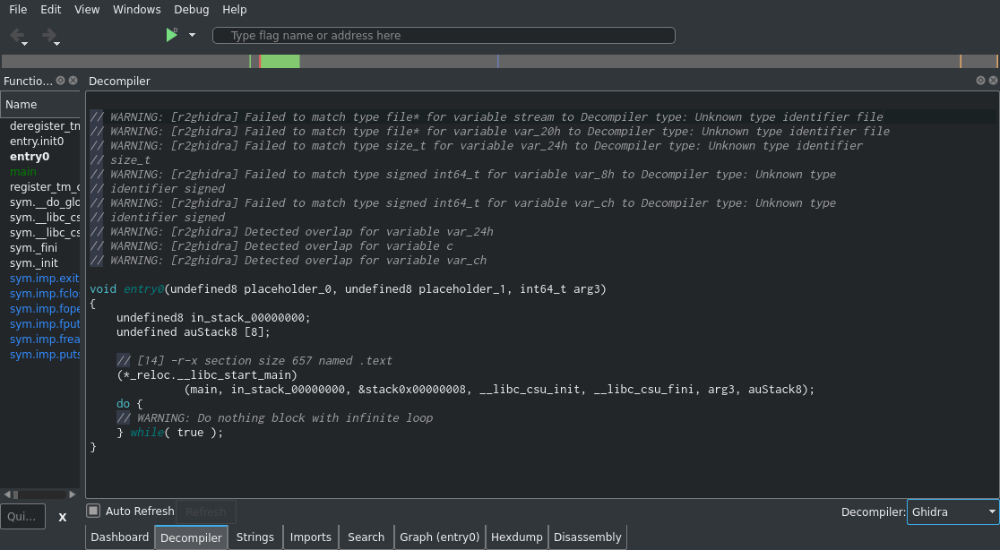
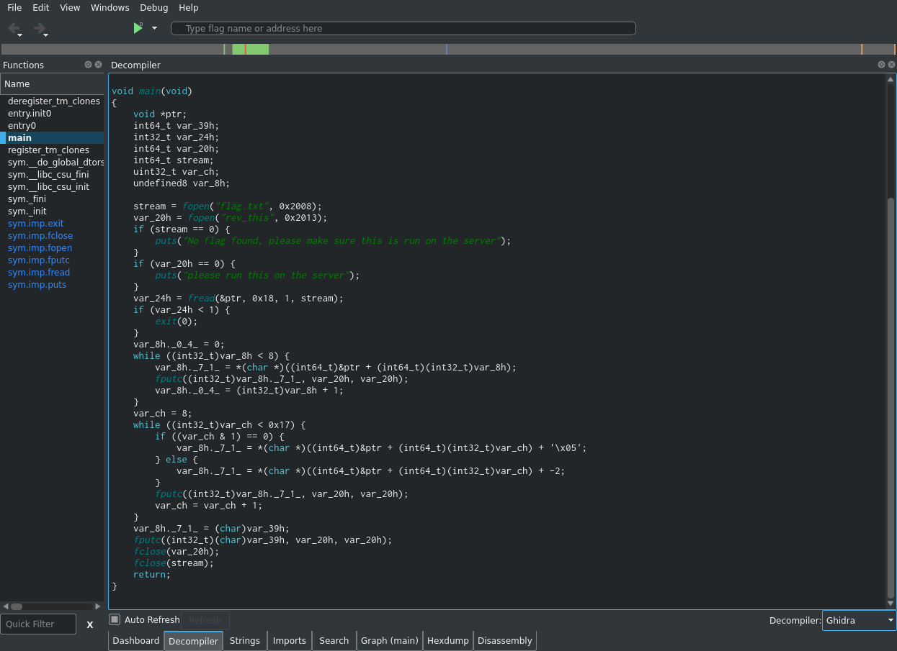

# PicoCTF 2019 - reverse_cipher
Author: PinkNoize

Reverse Engineering - 300

> We have recovered a binary and a text file. Can you reverse the flag. Its also found in /problems/reverse-cipher_0_b784b7d0e499d532eba7269bfdf6a21d on the shell server.

## TL;DR


# Writeup

This challenge provides us with a directory containing an executable (that we can't execute), a flag file and another text file.

```bash
user@pico-2019-shell1:/problems/reverse-cipher_0_b784b7d0e499d532eba7269bfdf6a21d$ ls -al
total 104
drwxr-xr-x   2 root       root              4096 Sep 28  2019 .
drwxr-x--x 684 root       root             69632 Oct 10  2019 ..
-r--r-----   1 hacksports reverse-cipher_0    24 Sep 28  2019 flag.txt
-rw-rw-r--   1 hacksports hacksports       16856 Sep 28  2019 rev
-rw-rw-r--   1 hacksports hacksports          24 Sep 28  2019 rev_this
```

Let's see what is in that text file.

```bash
user@pico-2019-shell1:/problems/reverse-cipher_0_b784b7d0e499d532eba7269bfdf6a21d$ cat rev_this 
picoCTF{w1{1wq87g_9654g}
```

This seems like the flag but if we try submitting it, it won't work. Perhaps `rev` can help us determine what the flag is.

```bash
user@pico-2019-shell1:/problems/reverse-cipher_0_b784b7d0e499d532eba7269bfdf6a21d$ file rev
rev: ELF 64-bit LSB shared object, x86-64, version 1 (SYSV), dynamically linked, interpreter /lib64/ld-linux-x86-64.so.2, for GNU/Linux 3.2.0, BuildID[sha1]=523d51973c11197605c76f84d4afb0fe9e59338c, not stripped
```

This is a 64 bit executable and the source is not provided so we will have to reverse engineer the executable. I will be using [Cutter](https://cutter.re/) for this, but any [reverse engineering tool](tools/tools.md#reverse-engineering) will work.

First, we will open `rev` with Cutter. You can download `rev` from the challenge description.



Cutter first opens the binary at `entry0` using the Ghidra decompiler. In most normal binaries `entry0` calls `__libc_start_main` which sets up the libc enviroment and starts `main`. Knowing this we can skip straight to `main`.

NOTE: We are using the decompiler to complete this challenge because it works pretty well with this binary. You should still take a look at the disassembly and the graph as those will help you when the decompiler fails you. Having the skills to understand assembly and manually translate to a higher level language will greatly help you in reverse engineering binaries.



As we can see from the decompilation, this program starts by opening two file, `flag.txt` and `rev_this`, and printing error codes if the files don't exist. The program then reads 0x18 bytes from `flag.txt` into `ptr`. This is one place where the decompiler is misleading. The decompiler identifies the type of `ptr` to be a `void *`, but it is actually a char[] of about 0x17 bytes. This can be checked from Cutter's automatic analysis in the disassembly.

```gas
324: int main (int argc, char **argv, char **envp);
; var void *ptr @ rbp-0x50
; var int64_t var_39h @ rbp-0x39
; var size_t var_24h @ rbp-0x24
; var file*var_20h @ rbp-0x20
; var file*stream @ rbp-0x18
; var signed int64_t var_ch @ rbp-0xc
; var signed int64_t var_8h @ rbp-0x8
; var int64_t c @ rbp-0x1
```

From this we can see that `ptr` is located at rbp-0x50 and the next local variable is at rbp-0x39. This means there are at least 0x17 bytes allocated for ptr (0x50 - 0x39 = 0x17). There may be more space allocated for `ptr` and the analysis happens to pick up local variables for accesses to constant indices of `ptr`. This is hinted at by the size argument to `fread` of 0x18.

For more information on library functions such as `fread`, try the command `man fread` (or google that).

To continue the analysis of the program, the program reads the flag into `ptr` using `fread`. The program then runs a loop that writes the first 8 bytes of the flag to `rev_this`. This means that the first 8 bytes of the flag is the first 8 bytes of `rev_this`. This loop is similar to the one below using python...

```python
for i in range(8):
    rev_this.append(flag[i])
```

The program then runs another loop. This loop adds 0x5 if the index is even and subtracts 2 if its odd. This loop is similar to the python code below...

```python
for i in range(8,0x17):
    if i % 2 == 0:
        rev_this.append(flag[i] + 5)
    else:
        rev_this.append(flag[i] - 2)
```

The program then writes `var_39h` to `rev_this`. Based off the decompilation, `var_39h` does not appear to be initialized. We can view the disassembly to figure out its value.

```gas
324: int main (int argc, char **argv, char **envp);
; var void *ptr @ rbp-0x50
; var int64_t var_39h @ rbp-0x39
```

As noted previously `ptr` is only 0x17 bytes long but `fread` reads 0x18 bytes. Since `var_39h` begins right after `ptr` and `fread` reads one byte after `ptr`, we can conclude that `var_39h` contains the last byte read from `fread`, which is the last byte of the flag.

To conclude the analysis, we can see that the "picoCTF{" and the ending "}" are left untouched in `rev_this`. The rest of the bytes have some value added or subtracted depending on the index. We can now write a python script to recover the original flag.

```python
mod_flag = bytearray("picoCTF{w1{1wq87g_9654g}",'utf-8')

for i in range(8,0x17):
    if i % 2 == 0:
        mod_flag[i] -= 5
    else:
        mod_flag[i] += 2

print(mod_flag.decode())
```

When we run this script we get the flag.

```python
>>> mod_flag = bytearray("picoCTF{w1{1wq87g_9654g}",'utf-8')
>>> 
>>> for i in range(8,0x17):
...     if i % 2 == 0:
...         mod_flag[i] -= 5
...     else:
...         mod_flag[i] += 2
... 
>>> print(mod_flag.decode())
picoCTF{r3v3rs39ba4806b} 
```