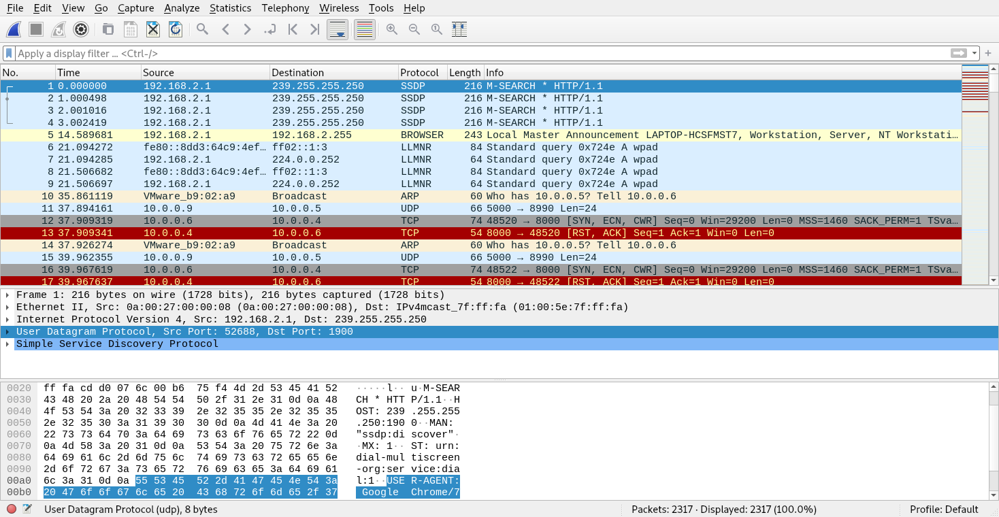
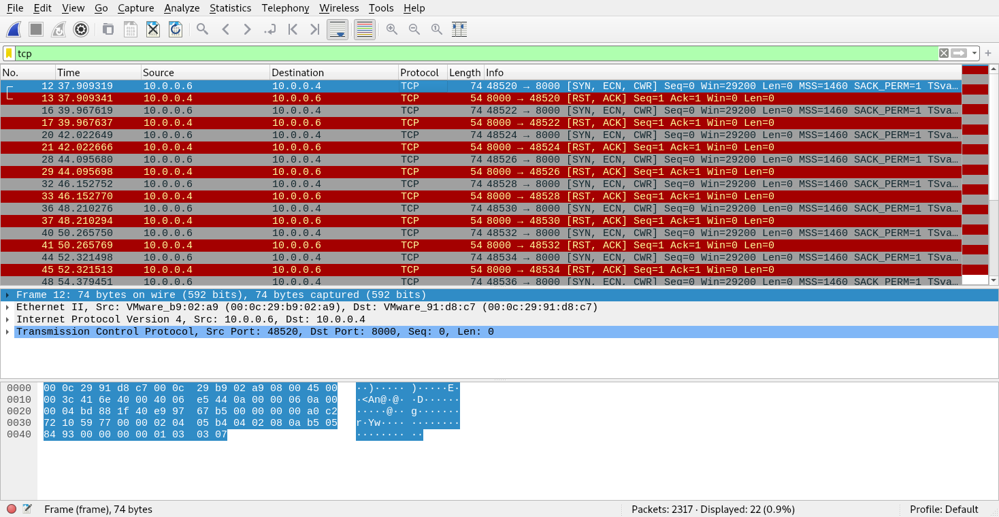
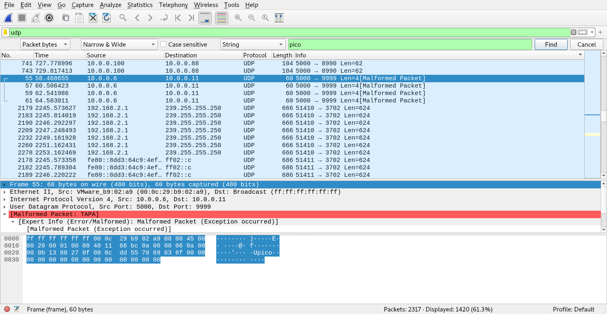

# PicoCTF 2019 - shark on wire 1
Author: PinkNoize

Forensics - 150

> We found this [packet capture](https://2019shell1.picoctf.com/static/ae9ca8cff43ed638ed5d137f9ece7455/capture.pcap). Recover the flag. You can also find the file in /problems/shark-on-wire-1_0_13d709ec13952807e477ba1b5404e620.

## TL;DR

This challenge provides a PCAP file. Search UDP streams for the flag.

# Writeup

This challenge provides us with a pcap file, which is a file containing captured network traffic. We can start by opening this file with [wireshark](https://www.wireshark.org/).

We then can filter for TCP as it is one of the most common protocols used in the internet. We can filter by typing `tcp` into the filter bar above.

We can now view the packets and follow the TCP streams but nothing interesting comes up. Lets try filtering by `udp` now. This gives us a lot of packets so we can search for the string 'pico' as we know it is the flag. You can do this by clicking on the Edit tab and clicking "Find Packet" or Ctrl + F. Set up the search like in the image below.

This yields some some packets with the string pico, but nothing other than that. If we go to the first set of UDP packets, we see that the first many are of LEN=1. Clicking through these show that the characters, p, i, c, o, show up in that order. We can then follow the UDP stream by right-clicking on the packet 63 and clicking follow then UDP stream.

This result is the flag, `picoCTF{StaT31355_636f6e6e}`.
