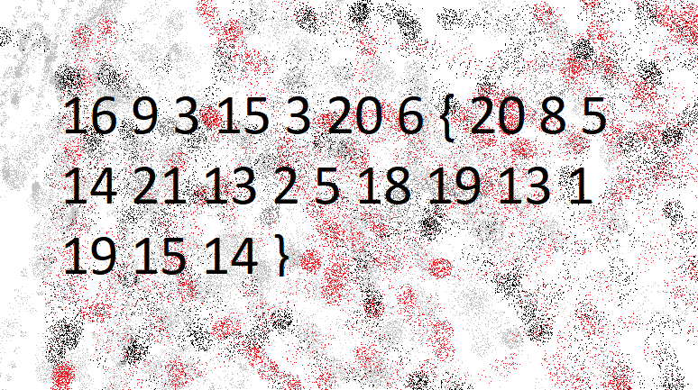

# PicoCTF 2019 - The Numbers
Author: PinkNoize

Cryptography - 50

> The numbers... what do they mean?

## TL;DR

Convert the numbers to letters to retrieve the flag.

# Writeup

This challenge provides us with an image containing a bunch of letters and curly brackets.

Knowing the the flag format is picoCTF{s0me_t3xt_h3r3}, we can conclude that the numbers before the { correspond to picoCTF. If we take a closer look we can see that numbers correspond to the index in the alphabet of the letter its replaced. We can figure out its all capitals from the provided hint, `The flag is in the format PICOCTF{}`. Translating it results in the flag, `PICOCTF{THENUMBERSMASON}`.